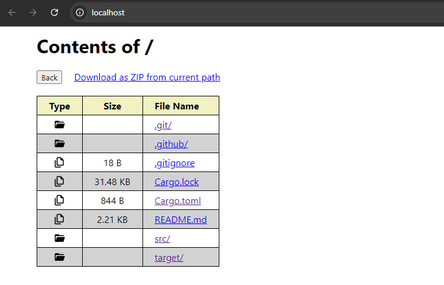

# Simple HTTP Server

This is a simple HTTP server that serves static content to GET requests. It is inspired by the `python -m http.server` command but with extra functionality.



## Installation

To use this server, you need to have Rust installed on your system. If you don't have Rust installed, you can download and install it from the official Rust website: [https://www.rust-lang.org/](https://www.rust-lang.org/)

Once you have Rust installed, you can clone the repository and build the server using the following commands:

```bash
git clone https://github.com/4jairo/rusty-pyserver.git
cd rusty-pyserver
cargo build --release
```


## Arguments

- Ports: Assigns single or multiple ports to the server. `default: 80`

```
rusty_pyserver 3000
rusty_pyserver 3000 3001 3002
```


- Html: The browser will show the content of the requested file instead of downloading it. This argument only changes the Content-Type header (from static "application/octet-stream" to actual mime), so it's up to the browser to show / download the content `default: disabled`

```
rusty_pyserver --html
```

- Spa: Serves the HTML file located in the current directory when the requested URI points to a direcotry (will enable the --html flag) `default: disabled` `default vaule: index.html`

```
rusty_pyserver --spa
rusty_pyserver --spa another_name.html

curl http://localhost:80/search?q=query      # returns the index.html (or specified name) file contents
curl http://localhost:80/main.css            # returns the requested file
```


- Local: Uses only localhost instead of both your localhost and the local network IP addresses `default: disabled`

```
rusty_pyserver          # localhost:80 & 0.0.0.0:80
rusty_pyserver --local  # localhost:80
```

- Logs file: Writes all the logs except the stats line to the specified file. `default: disabled` `default value: requests.log`

```
rusty_pyserver --log-file output.log
```


## Extra Functionality

In addition to serving static content, this server also supports the following features:

- Into Zip: Button that returns a .zip file with the files and directories from the requested path (compression not supported) 

## Contributing

If you would like to contribute to this project, feel free to open a pull request on the GitHub repository. Any contributions are welcome!

